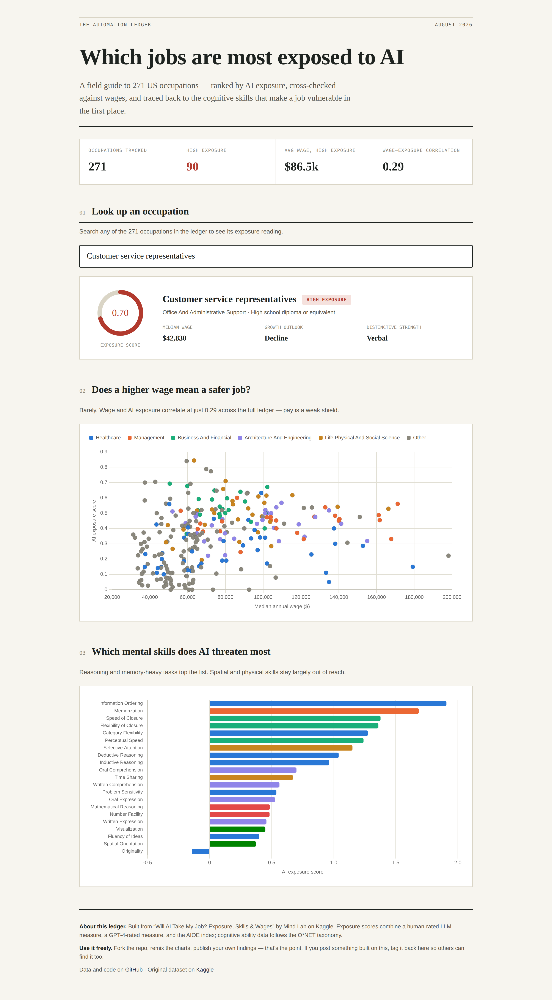

# The Automation Ledger

An interactive dashboard exploring AI exposure across 271 US occupations — wages, growth outlook, and the cognitive skills AI threatens most.

**[View the live dashboard →](#)** *https://jatin18012000.github.io/automation-ledger/*



## What's in it

- **Look up an occupation** — search any of 271 jobs and see its AI exposure score, wage, growth outlook, and dominant cognitive strength
- **Wage vs. exposure** — a scatter chart testing whether higher pay actually means lower AI risk (spoiler: barely — correlation is 0.29)
- **Cognitive skills ranking** — which specific mental abilities (reasoning, memory, perception...) are most exposed to AI, and which are safest

## Data source

Built on [**"Will AI Take My Job? Exposure, Skills & Wages"**](https://www.kaggle.com/datasets) by **Mind Lab**, published on Kaggle. Exposure scores combine three independent methods: a human-rated LLM measure, a GPT-4-rated measure, and the AIOE (AI Occupational Exposure) index. Cognitive ability profiles follow the O*NET taxonomy. Raw CSVs are included in `/data`.

## Run it locally

No build step, no dependencies to install — it's a static page.

```bash
git clone https://github.com/Jatin18012000/automation-ledger.git
cd automation-ledger
# open index.html directly in a browser, or serve it:
python3 -m http.server 8000
```

## Host it yourself for free (GitHub Pages)

1. Push this repo to your own GitHub account
2. Go to **Settings → Pages**
3. Under "Build and deployment," set **Source** to `Deploy from a branch`, branch `main`, folder `/ (root)`
4. Save — your live URL will be `https://Jatin18012000.github.io/automation-ledger/`

Costs nothing, no card required, updates automatically every time you push.

## Fork it, remix it, make it yours

This is meant to be built on, not just looked at. Ideas to try:

- Swap in a different exposure methodology as the primary score
- Add a state-by-state or industry filter
- Chart the education-required breakdown against exposure
- Build the same lookup for a different country's labor data

If you post something you built from this, **tag it back here** — I'd genuinely like to see what people find in it.

## License

Code in this repository is MIT licensed (see `LICENSE`) — use it however you like. The underlying dataset remains the work of its original author (Mind Lab); please keep the attribution above if you redistribute it.
